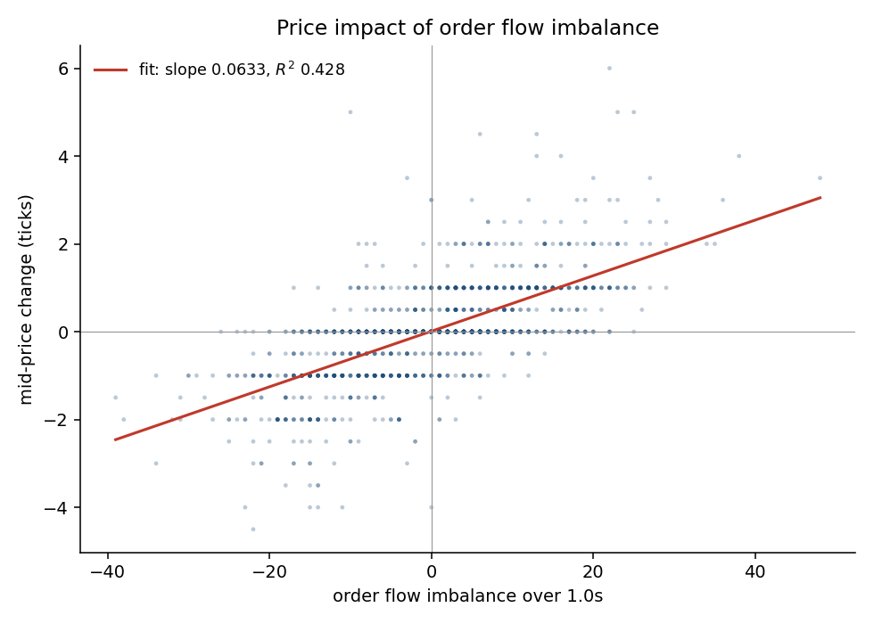
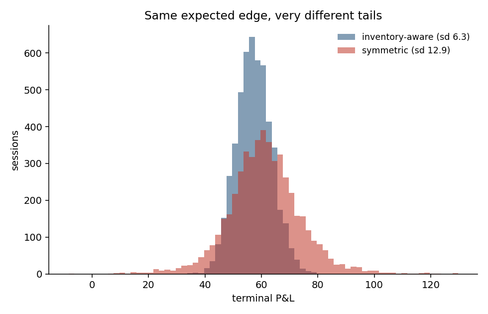

# lob-engine

A working slice of the plumbing that sits between an exchange and a
trading desk: rebuild the order book from a live feed, measure buying and
selling pressure from it, and turn that into orders over FIX with
pre-trade risk checks in the way.

Python 3.10+. One required dependency (numpy). 320 tests. Runs with no
network connection.

```bash
git clone <this repo> && cd lob-engine
pip install -r requirements.txt
make demo        # walk one order through the whole stack
make ofi         # reproduce the order flow imbalance result
```

---

## What problem is this solving?

If you want to trade on an exchange, you do not get a tidy list of
prices. You get a firehose.

The exchange sends you **one photograph** of the order book when you
connect, and after that it only sends you **changes**: "there are now 4
lots at 10.01 instead of 7", "the 9.98 level is gone". It is your job to
apply those changes, in order, and hold the current state of the book in
memory. If you miss one message, your copy of the book is wrong from that
moment on, and every decision you make from it is wrong too.

That is the first half of this project.

The second half is that once you have the book, you can measure something
useful from it. When people are queuing up to buy, the price tends to go
up shortly afterwards. That sounds obvious, but turning it into a number
you can actually trade on is not obvious, and there is a well-known 2011
paper that does it. This repo implements that measure and tests whether
it works.

The third half (there are three halves) is that sending an order is
harder than it looks. Exchanges speak an old, fussy protocol called FIX.
Orders get partially filled, rejected, cancelled while they are being
filled. Something has to keep track of what you actually own, and
something has to stop you sending a buy order for a million shares by
accident. That is the order management and risk layer.

None of this is the "find a profitable strategy" part of trading. It is
the part that has to work before a strategy can exist at all, and at a
broker or market maker it is most of the engineering.

---

## The five pieces

### 1. Rebuilding the order book

`src/lob_engine/book.py`

An order book is two queues: people willing to buy, sorted by who is
offering the most, and people willing to sell, sorted by who is asking
the least. The highest buy price is the **bid**, the lowest sell price is
the **ask**, and the gap between them is the **spread**.

```
        bids (buyers)              asks (sellers)
       12 lots @ 10.00     │     10.01 @ 15 lots      ← the "touch"
       20 lots @  9.99     │     10.02 @ 30 lots
       30 lots @  9.98     │     10.03 @ 40 lots
                           ▲
                    the spread: 0.01
```

Three things go wrong in real life, and all three are handled:

**Messages go missing.** Exchanges number their messages. If message 57
says "I follow message 56" but the last one you applied was 54, you have
lost one. The book refuses the update and raises, and the client throws
away the whole book and asks for a fresh photograph. It does **not** try
to carry on. A book you know is wrong is worse than no book, because you
will keep quoting prices from it.

**The book ends up crossed.** If your highest buyer is at 10.02 and your
lowest seller is at 10.01, that is impossible: they would have traded.
Seeing it means you applied something wrongly. There is an explicit check
for it.

**Prices are not floats.** This one is quiet and nasty. A book is a
lookup table keyed by price. In binary floating point, `0.1 + 0.2` is not
`0.3`. So a price you compute one way can fail to match the same price
computed another way, you end up with two entries for what should be one
level, and your book silently diverges from the exchange's. Every price
in here is an **integer number of ticks**: 68,123.45 is stored as
6,812,345. Conversion is exact.

### 2. Connecting to a venue

`src/lob_engine/feeds/`

Two adapters, for OKX and Bybit, using their free public market data
feeds. Read-only. No account, no API key, nothing is ever sent.

The two are included because they fail differently, which is the whole
point of having an abstraction:

- **OKX** tells you both "this is message 57" and "it follows 56". Gap
  detection is handed to you.
- **Bybit** only tells you "this is update 57". So the adapter has to work
  out what the previous one should have been. It assumes ids increase by
  one, which the venue documents, and derives `prev = id - 1`. The lazy
  alternative, remembering the last id you saw, **cannot detect a real
  dropped message** because a message you never received cannot change
  what you remember. Both behaviours are implemented and both are tested.

The parsing function is pure: raw bytes in, normalised update out, no
state, no I/O. That is what makes everything else in this repo testable
without a network.

> A Singapore note: MAS added Binance.com to its Investor Alert List in
> September 2021 over Payment Services Act concerns, so there is
> deliberately no Binance adapter here even for read-only data. If you add
> a venue, check its standing with MAS first.

### 3. Measuring order flow imbalance

`src/lob_engine/ofi.py`

This implements the estimator from **Cont, Kukanov & Stoikov (2011), "The
price impact of order book events"**.

The plain-English version: anything that can move the price in the next
few seconds shows up as a change at the front of the queue. Someone posts
a better bid, someone cancels, someone buys and eats the offer. Add up
those changes with a sign (buying pressure positive, selling pressure
negative) and you get **order flow imbalance**.

Formally, between two consecutive looks at the top of the book:

```
e_n = 1{Pb_n >= Pb_n-1}·qb_n  −  1{Pb_n <= Pb_n-1}·qb_n-1
    − 1{Pa_n <= Pa_n-1}·qa_n  +  1{Pa_n >= Pa_n-1}·qa_n-1
```

which reads case by case as:

| what happened | contribution |
|---|---|
| bid price unchanged, size changed | the change in size |
| someone posted a better bid | the whole new size, positive |
| the bid level disappeared | the old size, negative |
| ask price unchanged, size changed | minus the change in size |
| someone posted a better offer | the whole new size, negative |
| the ask level disappeared | the old size, positive |

Sum those over a time window and you have `OFI`. The paper's claim is
that the price change over that window is roughly a straight-line
function of `OFI`, and that the line is steeper when the book is thin.

### 4. Sending orders: FIX, state and risk

`src/lob_engine/fix.py`, `session.py`, `oms.py`, `risk.py`

**FIX** is how most exchanges and brokers accept orders. Messages look
like this, with an invisible separator byte between fields:

```
8=FIX.4.4 | 9=134 | 35=D | 49=LOBENG | 56=VENUE | 34=12 | ...
```

Two of those fields have to be computed exactly right or the
counterparty hangs up on you: field 9 is the byte length of the body, and
field 10 is a checksum. Both are implemented literally from the spec and
verified in tests against a **separately written** reference
implementation, because a round-trip test on its own would happily pass
with a wrong algorithm.

**The session layer** keeps the connection alive: logging on, heartbeats
when the line goes quiet, asking the counterparty to resend messages you
missed, and handling the replays when they arrive.

**The OMS** is the single source of truth for what you own. An order
moves through states like `PENDING_NEW → NEW → PARTIALLY_FILLED →
FILLED`, and not every move is legal. If a fill arrives for an order the
OMS believes was already cancelled, it raises instead of updating your
position. A crash you can recover from. A wrong position quietly
poisons every number downstream.

**The risk layer** is what stops accidents. Every order passes through it
first:

| check | stops |
|---|---|
| kill switch | everything, immediately, one flag |
| max order size and value | fat-finger typos |
| price collar | buying 20% above the market by mistake |
| max position | including what you would own if all resting orders filled |
| message throttle | a runaway quoting loop |
| self-trade prevention | trading with your own resting order |
| lot and tick size | orders the venue will just reject |

This layer is not decoration. MAS Notice SFA 04-N16 and the SGX rules on
algorithmic trading both require a member firm to have automated
pre-trade controls and to be able to stop its own algos.

### 5. A venue that models queue position honestly

`src/lob_engine/venue.py`

The matching engine uses **price-time priority**: better prices first,
and among equal prices, whoever arrived first.

That second part is the bit most simple backtests get wrong, and it is
worth being precise about. Suppose you post a bid for 10 lots at 10.00,
and there are already 20 lots there ahead of you.

```
someone sells 15 lots at 10.00   →   you are not filled.
                                     the 20 ahead of you absorb it.
                                     12 lots still ahead of you? no: 5.
12 lots ahead of you cancel      →   still not filled, but now you are first.
someone sells 6 lots             →   now you get filled.
```

A backtest that fills you whenever a trade prints at your price will show
a market-making strategy earning the spread on volume it would never have
touched. Here every resting order knows how much size is in front of it,
and that only decreases through real executions or explicit cancels
ahead.

---

## Results

Everything below is reproduced by `make all`. The numbers come from the
production code path: the simulator emits real OKX-format frames, which
are parsed by the real adapter and applied by the real book.

### The data is generated from order flow, not from a price model

`src/lob_engine/sim.py` implements the stochastic order book of **Cont,
Stoikov & Talreja (2010)**: four Poisson flows of limit orders, market
orders and cancellations on a price grid. The price is never drawn from a
distribution. It moves only when a queue at the front empties out, or
when someone posts a better quote.

That distinction matters. If the generator assumed a link between order
flow and price, then finding that link would prove nothing at all. It
assumes no such thing, so what follows is a real emergent property of the
mechanics.

### Order flow imbalance predicts price changes

200,000 events, about 25 minutes of simulated market time.

| window | buckets | R² | slope | t-stat (Newey-West) |
|---|---|---|---|---|
| 0.5s | 2,982 | 0.311 | 0.052 | 27.5 |
| 1.0s | 1,491 | 0.428 | 0.063 | 26.8 |
| 5.0s | 299 | 0.642 | 0.085 | 19.0 |
| 10.0s | 150 | 0.687 | 0.090 | 14.5 |

The relationship gets stronger over longer windows, which is what you
would expect: the noise averages out and the signal does not. The paper
reports the same pattern on real equity data.



The banding in the scatter is real, not a plotting artefact: the mid moves
in half-tick steps, so the y-axis is genuinely discrete.

**The comparison the paper actually cares about.** Run the same
regression using signed trade volume instead of order flow imbalance, on
identical data:

| measure | R² |
|---|---|
| order flow imbalance | **0.428** |
| signed trade volume | 0.022 |

That is the paper's central point. Trades are only part of the story.
Cancellations and new quotes move prices too, and a measure built from
the book captures them while a measure built from the tape does not.

### Impact is bigger when the book is thin

Sorting the same buckets into five groups by how much size was resting at
the touch:

| depth quintile | mean depth | slope |
|---|---|---|
| Q1 (thinnest) | 16.02 | 0.107 |
| Q2 | 18.70 | 0.069 |
| Q3 | 20.49 | 0.063 |
| Q4 | 22.48 | 0.051 |
| Q5 (thickest) | 25.77 | 0.034 |

Monotonic, exactly as predicted: the same amount of buying pressure moves
a thin book more than a thick one.

**Where this does not match the paper.** Fitting `log(slope)` against
`log(depth)` gives an elasticity of **−2.33** (R² 0.98). The paper's model
implies about **−1.00**. The direction replicates cleanly; the magnitude
does not. Two honest reasons: the paper measures across real stocks with
genuinely different tick sizes and liquidity, whereas here depth varies
endogenously, driven by the same order flow that moves the price, which
biases the estimate. Reported rather than buried.

### Inventory-aware quoting cuts risk, and it is not free

`src/lob_engine/strategy.py` implements the quoting rule from
**Avellaneda & Stoikov (2006)**.

The problem it solves: a market maker who always quotes symmetrically
around the mid price has no way to get flat. Inventory wanders off and
the P&L develops fat tails that have nothing to do with skill. The fix is
to quote around a **reservation price** that shifts against your
position. Long 400 lots? Both your quotes move down, so you are more
likely to be sold to than bought from, so inventory drifts back toward
zero.

5,000 simulated sessions, both strategies quoting the same average
spread so the comparison is about skew and not about who quotes tighter:

| | mean P&L | **sd of P&L** | 5th pct | 95th pct | **sd of final inventory** |
|---|---|---|---|---|---|
| inventory-aware | 57.33 | **6.25** | 47.23 | 67.96 | **2.98** |
| symmetric | 61.11 | **12.95** | 40.87 | 82.15 | **8.14** |



P&L standard deviation 52% lower. Final inventory standard deviation 63%
lower. Mean P&L 6% **lower**.

That last number is the point. The paper's result was never "this makes
more money". It is "this makes almost the same money with half the
variance", and you pay for the skew in expected edge. A repo claiming the
inventory strategy also earns more would be a repo with a bug in it.

### Latency, measured per stage

The pipeline from raw bytes to a framed FIX order, 100,000 messages,
percentiles in microseconds:

| stage | p50 | p90 | p99 | p99.9 |
|---|---|---|---|---|
| parse JSON | 5.38 | 7.46 | 14.79 | 30.54 |
| apply to book | 0.98 | 1.44 | 2.81 | 14.62 |
| top of book + OFI | 1.65 | 2.10 | 4.38 | 17.15 |
| risk checks | 5.51 | 6.18 | 12.12 | 26.08 |
| FIX encode | 11.43 | 12.77 | 27.91 | 76.71 |

About 92,000 messages/second end to end. Absolute figures depend on the
machine and move around by 10-20% between runs on shared hardware; read
the p99.9 column, not p50, and treat the harness as a regression detector
rather than an absolute benchmark.

**One documented optimisation.** The profile pointed at price-string
conversion inside the parse stage: building a `Decimal` for every level
was the single most expensive operation. Replacing it with exact integer
string arithmetic, keeping `Decimal` as a fallback:

| | before | after | |
|---|---|---|---|
| `to_ticks` single call | 0.765 µs | 0.471 µs | 1.6× faster |
| parse one delta frame | 5.62 µs | 5.12 µs | −9% |
| parse one 50-level snapshot | 64.93 µs | 46.45 µs | −28% |

Measured as a paired comparison in one process, which is the only
reliable way to do it here. The fast path is checked against the
`Decimal` path on tens of thousands of random inputs in
`tests/test_types.py`, because an optimisation that changes answers is
not an optimisation.

---

## Using it

```bash
make demo     # one order through session, risk, venue, OMS, with commentary
make data     # generate the synthetic capture (no network needed)
make ofi      # the order flow imbalance replication, plus a scatter plot
make mm       # inventory-aware vs symmetric quoting
make bench    # per-stage latency
make test     # 320 tests
make lint     # ruff
```

Against a live venue:

```bash
python scripts/capture.py --venue okx --symbol BTC-USDT --seconds 300
python scripts/analyse_ofi.py --capture data/okx_BTC-USDT_*.jsonl.gz
```

Capture writes the **raw bytes** plus your own receive timestamp, never a
parsed version. If your parser turns out to have a bug you want to be
able to fix it and re-run the same data; a capture of parsed objects bakes
the bug in permanently.

### Watching the book live

Two front ends, one feed. Both drive the same `Feed` object in
`web/feed.py`, so there is one venue connection, one book and one set of
numbers behind either of them.

```bash
pip install -r requirements.txt

streamlit run streamlit_app.py     # polling, ~2 Hz, free to host
python web/server.py               # websocket push, 10 Hz, http://localhost:8000
```

Both show the ladder, spread, microprice, cumulative depth, order flow
imbalance and the feed health counters - resyncs, reconnects, parse
errors, sequence - because those counters are the reason to trust, or
not trust, everything above them.

The rate split is the part worth reading: the feed applies every update
as it arrives, while a separate timer samples the book and pushes one
payload to every viewer. Nothing queues per-message, so a burst makes
the numbers move faster rather than making the display fall behind.
`web/README.md` has the details and the deployment notes.

### Proving the gap recovery actually works

Drop one message in every 200 and see what happens:

```bash
python scripts/gen_synthetic.py --events 20000 --drop-every 200
python scripts/analyse_ofi.py --capture data/synthetic_okx.jsonl.gz
```

```
wrote 20,001 messages    snapshots: 101
deliberately dropped 100 messages to exercise gap recovery

20,001 messages -> 19,803 book updates, 198 resyncs, 0 parse errors
book integrity ok: True   crossed seen: 0   gaps: 0
```

Read that as a sequence. A delta goes missing. The **next** delta arrives
claiming to follow one the book never applied, so the gap is caught and
the book is discarded. A snapshot lands shortly after, as it would when a
live client resubscribes, and the book is rebuilt. 100 drops produce 198
detected gaps, because typically two deltas arrive before the snapshot
does.

The numbers that matter are the last two: 19,803 of 20,001 updates still
applied, and **zero crossed books**. The gaps were caught rather than
absorbed. A book engine that silently applied those deltas would show no
resyncs at all and would be quietly wrong for the rest of the session,
which is exactly the failure this is built to make impossible.

---

## Layout

```
src/lob_engine/
  types.py        integer-tick prices, top of book, normalised update
  book.py         L2 reconstruction, gap detection, integrity checks
  ofi.py          order flow imbalance (Cont-Kukanov-Stoikov)
  stats.py        OLS with Newey-West standard errors
  fix.py          FIX 4.4 codec: framing, parsing, stream splitting
  session.py      FIX session: heartbeats, sequencing, resend
  oms.py          order state machine, positions, fills, P&L
  risk.py         pre-trade controls and kill switch
  venue.py        matching engine with queue position
  strategy.py     Avellaneda-Stoikov quoting and its benchmark
  sim.py          stochastic order book (Cont-Stoikov-Talreja)
  latency.py      per-stage percentile recording
  recorder.py     raw capture and replay
  feeds/          venue adapters, async client, replay driver
scripts/          demo, capture, analysis, benchmarks
tests/            320 tests
web/              live dashboard: shared feed + websocket server
streamlit_app.py  the same feed, as a Streamlit page
docs/architecture.md   design decisions and why
```

---

## Known limitations

Written down because the things a simulator gets wrong are more
interesting than the things it gets right.

- **It is Python.** Real tick-to-trade paths are C++ with kernel bypass,
  and live in single-digit microseconds or below. This establishes the
  logic and the measurement harness. It is not a production low-latency
  stack.
- **Queue position is only knowable in simulation.** In `MockVenue` the
  venue is ours, so the queue is exact. Against a real capture it is not
  observable, because a book feed cannot distinguish a market order from
  a cancellation, so you cannot tell whether the size ahead of you traded
  or withdrew.
- **The headline numbers are from simulated data.** They come from a
  model of order flow, not from a market. The OKX and Bybit adapters are
  written and unit-tested against the documented wire formats, but the
  published results were produced from the simulator, and the elasticity
  gap discussed above is one visible consequence. `scripts/capture.py`
  exists so you can run the same analysis on real data yourself.
- **Crypto is not SGX.** SGX depth data is licensed and expensive, so the
  live adapters point at crypto venues, which trade continuously and have
  no auction periods. Nothing here models the SGX pre-open auction, the
  midday break, the closing auction, or tiered minimum bid sizes. Those
  are real work for anything touching Singapore equities.
- **No venue CRC validation.** OKX publishes a CRC32 over the top 25
  levels, which would catch corruption that sequence numbers miss.
  Implementing it needs the venue's exact string formatting retained,
  which conflicts with converting to integer ticks on ingest. Left out
  rather than done half-right.
- **Fills in the simulator are optimistic** in one specific way: latency
  between deciding to quote and the quote arriving at the venue is not
  modelled, so there is no adverse selection from being slow.
- **Nothing here is a trading strategy.** The OFI regression is a
  replication of a published result, not an alpha signal, and the
  R² figures come from a simulator whose parameters I chose. Harvey &
  Liu's work on multiple-testing haircuts is the relevant caution: a
  Sharpe ratio found by searching is not a Sharpe ratio you will earn.

---

## Papers implemented

- Rama Cont, Arseniy Kukanov, Sasha Stoikov (2011), *The price impact of
  order book events* — the OFI estimator in `ofi.py`
- Rama Cont, Sasha Stoikov, Rishi Talreja (2010), *A stochastic model for
  order book dynamics*, Operations Research — the simulator in `sim.py`
- Marco Avellaneda, Sasha Stoikov (2006), *High-frequency trading in a
  limit order book* — the quoting rule in `strategy.py`
- Whitney Newey, Kenneth West (1987) — the HAC standard errors in
  `stats.py`

Useful background that shaped the design rather than being implemented
directly: Gould et al., *Limit order books* (a survey); Budish, Cramton &
Shim (2015) on the latency arms race; Campbell Harvey & Yan Liu,
*Evaluating trading strategies*, on why backtested performance is
systematically overstated.

## Licence

MIT.
